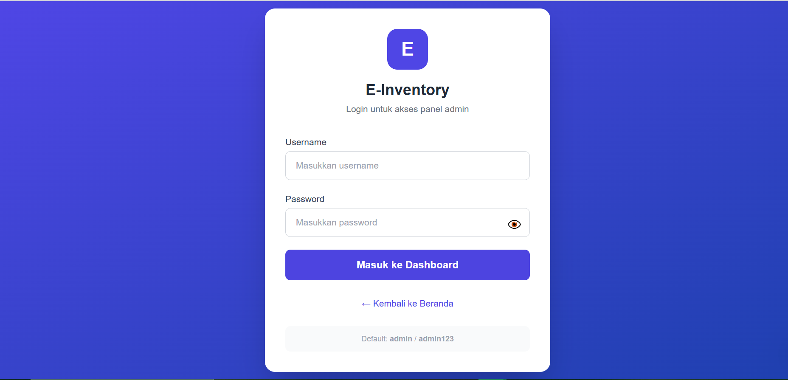
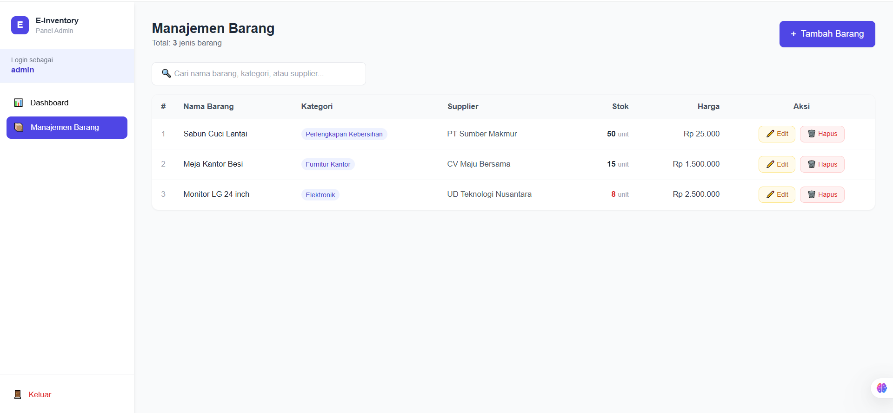
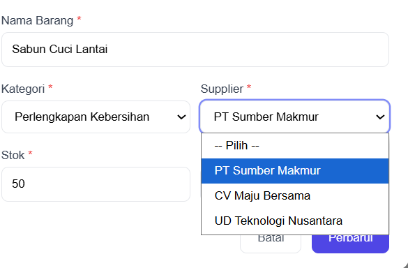
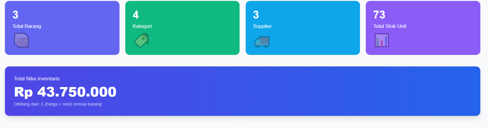

# e-Inventory & CI4 Project

Dokumentasi lengkap dan panduan untuk menjalankan, memahami, dan mengembangkan project ini.

> Struktur repository utama:

- `ci4/` — aplikasi CodeIgniter 4 lengkap (frontend / backend kecil)
- `e-inventory/` — aplikasi e-inventory (backend-api dan frontend-spa)

Tujuan README ini: memberikan penjelasan mendetail, diagram arsitektur ringan, langkah setup lokal, daftar fitur dan halaman, serta ruang untuk menempelkan screenshot/gambar pada setiap bagian fitur.

---

## Daftar Isi

1. [Ringkasan Proyek](#ringkasan-proyek)
2. [Arsitektur & Komponen](#arsitektur--komponen)
3. [Persyaratan Sistem](#persyaratan-sistem)
4. [Setup Lokal (Windows / XAMPP)](#setup-lokal-windows--xampp)
5. [Database & Migrasi](#database--migrasi)
6. [Menjalankan Aplikasi](#menjalankan-aplikasi)
7. [Fitur & Halaman (dengan ruang gambar)](#fitur--halaman-dengan-ruang-gambar)
8. [API Endpoints (backend-api)](#api-endpoints-backend-api)
9. [Frontend SPA: Halaman & Alur UI](#frontend-spa-halaman--alur-ui)
10. [Troubleshooting umum](#troubleshooting-umum)
11. [Kontribusi & Pengembangan](#kontribusi--pengembangan)
12. [Lisensi]

---

## Ringkasan Proyek

Proyek ini berisi dua bagian utama:

- `ci4/`: CodeIgniter 4 starter/boilerplate yang berisi konfigurasi, controller, model, view, dan modul terkait.
- `e-inventory/`: aplikasi inventaris yang terbagi menjadi `backend-api/` (API berbasis PHP/CI4 atau microservice) dan `frontend-spa/` (single-page app minimal).

Kegunaan: sistem manajemen inventaris sederhana — produk, supplier, stok, transaksi, laporan, dan otorisasi admin.

---

## Arsitektur & Komponen

- Web server: Apache + PHP (XAMPP) direkomendasikan untuk pengembangan lokal.
- Database: MySQL / MariaDB.
- Backend API: `e-inventory/backend-api` (folder contains API code & writable folder for uploads).
- Frontend: `e-inventory/frontend-spa` (berkas statis JS/HTML).

Diagram sederhana (logis):

Frontend SPA <--> Backend API <--> Database

File penting:

- [ci4](ci4) — core CodeIgniter app and configs
- [e-inventory/backend-api](e-inventory/backend-api) — API service
- [e-inventory/frontend-spa](e-inventory/frontend-spa) — single page frontend

---

## Persyaratan Sistem

- Windows 10/11 (pengembangan lokal) atau Linux
- PHP >= 7.4 (sesuaikan dengan projek; periksa `composer.json`)
- Composer
- MySQL / MariaDB
- XAMPP (Apache + MySQL + PHP) atau setara

---

## Setup Lokal (Windows / XAMPP)

1. Pastikan XAMPP terpasang dan Apache + MySQL berjalan.
2. Tempatkan folder project di `C:/xampp/htdocs/` atau path serupa.
3. Import database:

   - Gunakan salah satu file SQL pada root (`setup_database.sql`, `database_setup.sql`, atau `SQL_INSERT_DATA.sql`) sesuai kebutuhan.
   - Contoh impor lewat phpMyAdmin: pilih database baru → Import → pilih file `.sql`.

4. Konfigurasi environment:

   - Salin `env` ke `.env` pada folder `ci4/` atau `e-inventory/backend-api` jika diperlukan.
   - Sesuaikan `database.default` credentials, baseURL, dan pengaturan lainnya.

5. Install dependencies (jika ada):

```bash
cd e-inventory/backend-api
composer install

# Jika frontend menggunakan npm:
cd ../frontend-spa
# npm install
```

6. Akses aplikasi via browser:

- Backend API (contoh): `http://localhost/e-inventory/backend-api/public/index.php` atau sesuai konfigurasi Apache rewrite.
- Frontend SPA: `http://localhost/e-inventory/frontend-spa/index.html`.

Tips: Jika menggunakan `virtual host`, arahkan `DocumentRoot` ke `.../backend-api/public` atau `ci4/public`.

---

## Database & Migrasi

- File SQL tersedia di root: `setup_database.sql`, `simple_setup.sql`, `MANUAL_SETUP.sql`, dll.
- Untuk perubahan skema, gunakan file SQL yang sesuai, atau tambahkan migration di `ci4/app/Database/Migrations`.

---

## Menjalankan Aplikasi

1. Start Apache & MySQL via XAMPP Control Panel.
2. Buka browser ke `http://localhost/` lalu navigasikan ke folder project.
3. Jika error 404, periksa `public/index.php` dan konfigurasi `.htaccess` di folder `public` dan `writable`.

---

## Fitur & Halaman (dengan ruang gambar)

Di bawah ini setiap fitur utama dijelaskan lengkap, dan disediakan placeholder gambar yang bisa Anda ganti dengan screenshot Anda sendiri. Simpan gambar pada folder `docs/images/` atau `e-inventory/frontend-spa/assets/images/` lalu ganti path di README.

Catatan: setiap blok memiliki area "GAMBAR" — tempelkan screenshot Anda di sana.

### 1) Autentikasi & Otorisasi

- Deskripsi: login, logout, manajemen session, hak akses admin.
- Lokasi: `e-inventory/backend-api` (controller auth), `ci4/Controllers` (jika terintegrasi).

GAMBAR (letakkan screenshot di `docs/images/authentication.png`):



Instruksi: ganti file `docs/images/authentication.png` dengan screenshot Anda.

### 2) Dashboard Admin

- Deskripsi: ringkasan statistik, notifikasi, quick actions.
- Lokasi: `ci4/Views/dashboard` atau `frontend-spa` halaman dashboard.

GAMBAR:



### 3) Manajemen Produk (Inventory)

- Deskripsi: daftar produk, tambah/edit/hapus, stok, kategori.
- Lokasi: `e-inventory/backend-api` (endpoints produk), `frontend-spa` (UI produk).

GAMBAR:


### 4) Detail Produk & History Stok

- Deskripsi: halaman detail, log penambahan/pengurangan stok.
- Lokasi: model `Models/ProductModel`, controller terkait.

GAMBAR:


### 5) Supplier & Vendor

- Deskripsi: input supplier, kontak, histori PO.

GAMBAR:



### 6) Transaksi / Mutasi Stok

- Deskripsi: melakukan penerimaan barang, pengeluaran, transfer antar gudang.

GAMBAR:




---

## API Endpoints (backend-api)

Berikut sekumpulan endpoint utama. Sesuaikan path dan param sesuai implementasi aktual di `e-inventory/backend-api`.

- `POST /api/auth/login` — autentikasi
- `POST /api/auth/logout` — keluar
- `GET /api/products` — daftar produk (filter, pagination)
- `GET /api/products/{id}` — detail produk
- `POST /api/products` — tambah produk
- `PUT /api/products/{id}` — update produk
- `DELETE /api/products/{id}` — hapus produk
- `GET /api/suppliers` — daftar supplier
- `POST /api/transactions/receive` — penerimaan barang

Contoh cURL:

```bash
curl -X GET "http://localhost/e-inventory/backend-api/public/api/products" \
  -H "Authorization: Bearer <TOKEN>"
```

Tambahkan dokumentasi lebih rinci pada file `docs/api.md` jika diperlukan.

---

## Frontend SPA: Halaman & Alur UI

- Halaman principale: Home / Dashboard
- Halaman produk: Daftar Produk, Tambah/Edit Produk, Detail
- Halaman transaksi: Penerimaan, Pengeluaran
- Halaman supplier & pengguna

Untuk tiap halaman, taruh screenshot di `docs/images/` lalu update tag gambar pada README.

---

## Troubleshooting umum

- 500 Internal Server Error: cek `writable/logs` dan file `.env`.
- Error koneksi DB: periksa credentials di `.env` atau `app/Config/Database.php`.
- Rewrite / 404: pastikan `.htaccess` di `public/` aktif, mod_rewrite di Apache di-enable.

---

## Kontribusi & Pengembangan

- Buat branch baru untuk fitur/bugfix: `git checkout -b feature/xxxx`.
- Ikuti konvensi coding CodeIgniter (models, controllers, views terpisah).
- Untuk dokumentasi tambahan, tambahkan file di `docs/`.

Jika Anda ingin, saya bisa:

- Menambahkan semua gambar placeholder ke `docs/images/` sebagai file kosong.
- Mengisi dokumentasi API secara otomatis dari controller (jika Anda ingin saya membaca file controller dan menyusun daftar endpoint).

---

## Lisensi

Lihat file `LICENSE` di root repository untuk detail.

---

## Petunjuk Menambahkan Gambar ke README

1. Buat folder `docs/images/` di root repository.
2. Taruh screenshot, beri nama sesuai fitur, mis. `authentication.png`, `products.png`.
3. Commit dan push gambar ke repo.
4. Jika ingin saya menambahkan gambar ke README langsung, unggah file gambarnya di sini atau beri tahu nama file, saya akan sisipkan.

Rekomendasi ukuran gambar: lebar 1000–1400 px, rasio 16:9 atau 4:3, format PNG atau JPEG.

---

Terakhir: jika Anda ingin README ini ditambahkan ke folder tertentu atau ditulis dalam bahasa Inggris, beri tahu saya.
